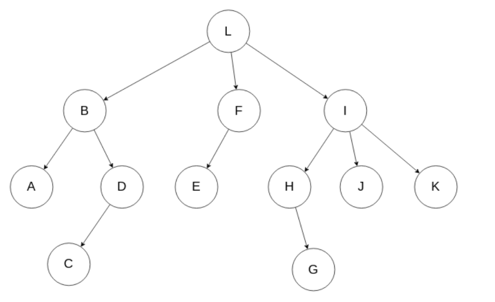

# Реализация обходов дерева

## Задание:
Реализовать 6 функций на одном из языков программирования, которые делают три обхода DOM дерева в рекурсивной и нерекурсивной реализации - прямой, обратный и обход по уровням. Детали есть в презентации. Само дерево реализовывать необязательно. Желательно, чтобы рекурсивная реализация не содержала циклов.

## Решение:

Реализация непосредственно обходов находится в файле DomTree.java. 

Реализовано:
- в нерекурсивной реализации:
  - прямой обход: preorderTraversal()
  - обратный обход: postorderTraversal()
  - обход по уровням: levelOrderTraversal()
- в рекурсивной реализации:
  - обход по уровням: recursiveLevelOrderTraversal()
  
  Реализация узла дерева в файле TreeNode.java. Тестовое дерево, представленное ниже, составлено в Main.java.
  
   
